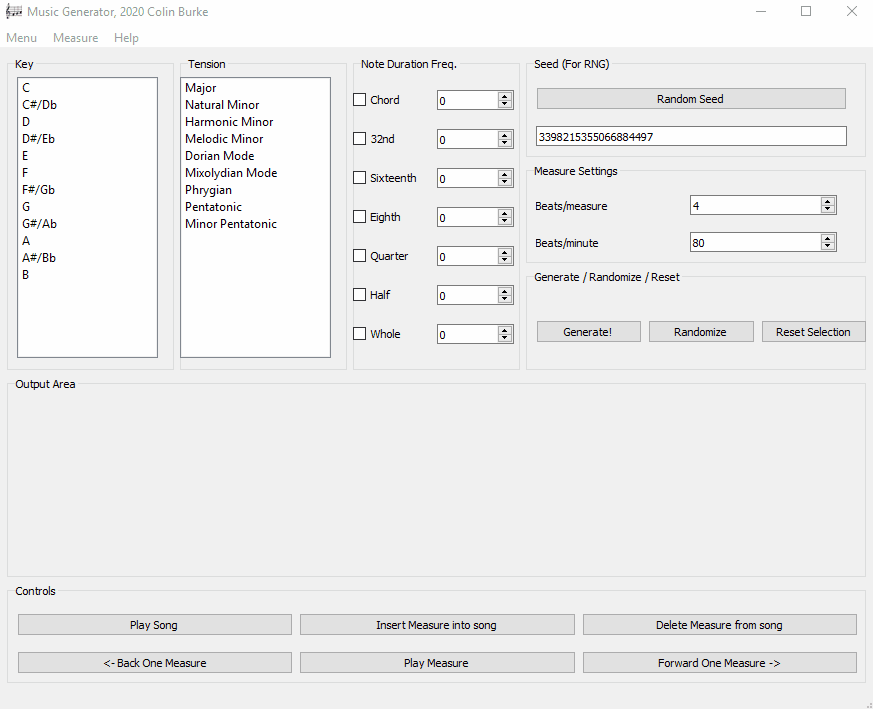

# PyMusicGen2
Music generator made in Python and QT. 

A QT implementation of an old [CLI dream](https://github.com/crawsome/pymusicgen) I had. 



## Quickstart
1. run ```pymusicgen.py```
2. Click "Randomize" to randomize all song attributes, or choose them yourself
3. Click "Generate" to create a measure. 
4. Click "Play measure" to hear the measure
5. If you like the measure, click "Insert into song." (WIP)
6. Click "Forward One Measure" or "Back One Measure" to page through the measures of the song, and to insert measures in other places. 
7. If you want to delete the measure you are looking at, you can click "Delete Measure"
8. If you like the song, you can go to **File** -> **Save** and you can save the file in MIDI format.
9. Click "Random Seed" then "Generate" again to create a new measure with the same song attributes. 

More features to come as I develop the rest of the GUI

## Manual Use
1. Select a Key in the **Key** list. 
2. Select a Tension in the **Tension** list. 
3. Select note duration frequencies. The song will randomly choose from the proportion of notes you select here as the song's rhythm.
4. Enter a Seed (A positive whole number). This determines the "random" number generators deterministic pattern in Python. 
5. Define the Beats Per Measure. This determines how many notes can fit in your measure

For now, the song will play OK in the app, but eventually, it will play perfectly to BPM timing when I implement MIDI (Next couple weeks). 

## Define the Beats Per Minute (Doesn't work yet)
When you outout to MIDI, this value will be the tempo of the song. 

Please [contribute](https://colinburke.com/contribute) if this helped you!
